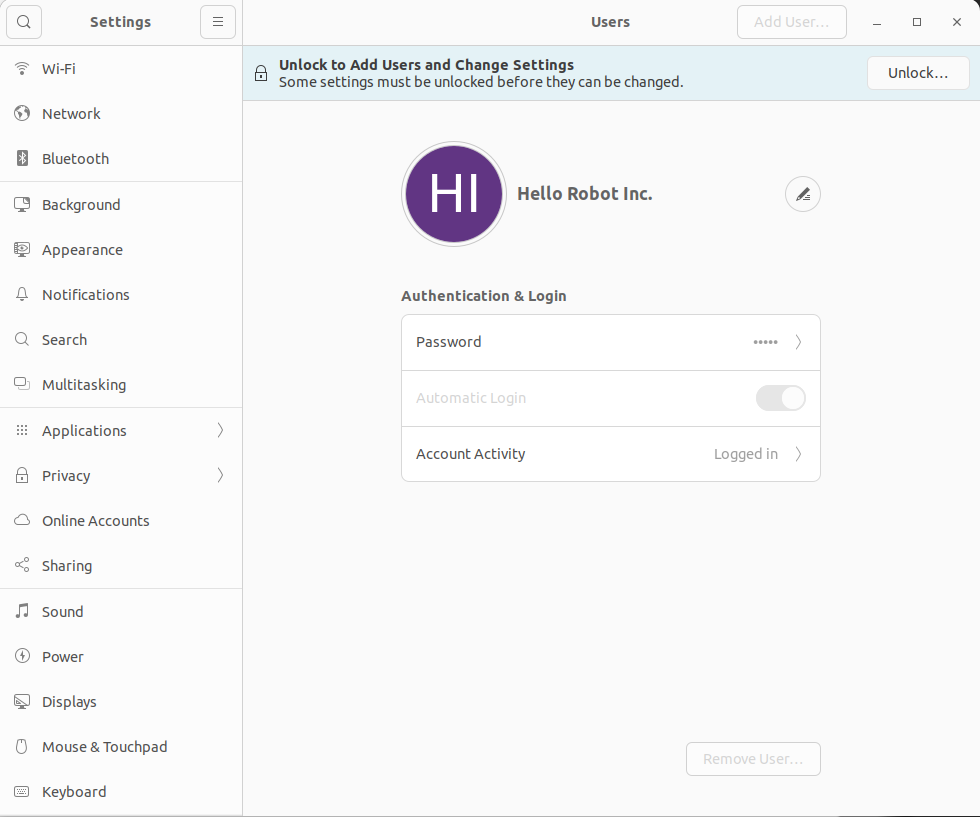
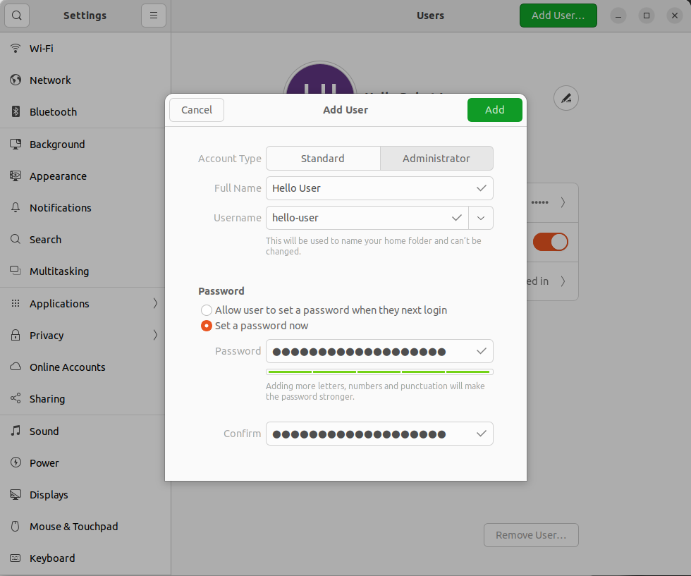

# Adding a New User

## Why

If you're sharing Stretch with other developers, it can be helpful to create separate accounts for yourself and your team members. Your code and data will be password protected in your own account, and other developers can modify their own code without accidentally affecting yours.

!!! warning

```
User accounts cannot completely insulate your account from changes in another. For example, if someone attaches a new gripper or end-effector tool to the robot, your account's software would have an outdated configuration for what tool is attached to the robot. A non-exhaustive list of changes that could break/affect accounts:

  - Making hardware changes to the robot
  - Updating the firmware
  - Installing/changing [APT packages](#apt-package-manager)
```

## How

From the admin account, open a terminal and pull down the latest Stretch Install repository:

```{.bash
cd ~/stretch4_install && git pull
```

Run the new user install script and provide the new username using the `-u` flag. This will automatically create the user account (prompting for their new password), provide them admin privileges, set up their home directory, and install the new user environment:

```{.bash
./stretch_new_user_install.sh -u new_developer_name
```

Finally, log out and log back in as the new user account. Reboot the robot and run a system check to confirm everything was set up correctly.

```{.bash
stretch_system_check.py
```

### Calibration Data Copy

During the installation process, the setup script automatically runs the `stretch_copy_calibration.sh` utility. This utility copies the calibration and robot configuration files from the main `hello-robot` account (specifically from `/home/hello-robot/stretch_user/$HELLO_FLEET_ID`) to the new user's account. This ensures that the new user has access to all current robot calibrations (e.g. stepper calibrations, camera extrinsics) rather than defaulting to factory configuration.

The `stretch_copy_calibration.sh` script supports the following command-line flags:
- `-s, --source USER` : Source user account to copy calibration from (default: `hello-robot`).
- `-u, --user USER`   : Target user account to copy calibration to (default: current user).
- `-f, --force`        : Force the copy to run without prompting the user. If this flag is omitted, the script lists the files to be copied and prompts the user for confirmation.

If you ever need to manually copy or sync the calibration files from the `hello-robot` account to a new user account later, you can run the utility script with `sudo` at any time:

```{.bash .shell-prompt .copy}
sudo ~/stretch4_install/stretch_copy_calibration.sh -u new_developer_name
```

Your new user account is now set up successfully!

## Manually add a new user

If you would like to manually create the new user and setup the account, you can follow the steps below:

Start by logging into the admin Hello Robot user. Go to Users system settings and unlock adminstrator actions.



Click "Add User..." and complete the subsequent form. The new user needs to be an administrator.



Log out and back in as the new user. Open a terminal and execute the following to pull down the Stretch Install repository:

```{.bash
git clone https://github.com/hello-robot/stretch4_install ~/stretch4_install
```

Make sure it's up-to-date:

```{.bash
cd ~/stretch4_install && git pull
```

Run the new user install script to set up the SDK for this new account:

```{.bash
./stretch_new_user_install.sh
```

Finally, reboot the robot and run a system check in the new user account to confirm everything was set up correctly.

***

All materials are Copyright 2020-2026 by Hello Robot Inc. Hello Robot and Stretch are registered trademarks.
