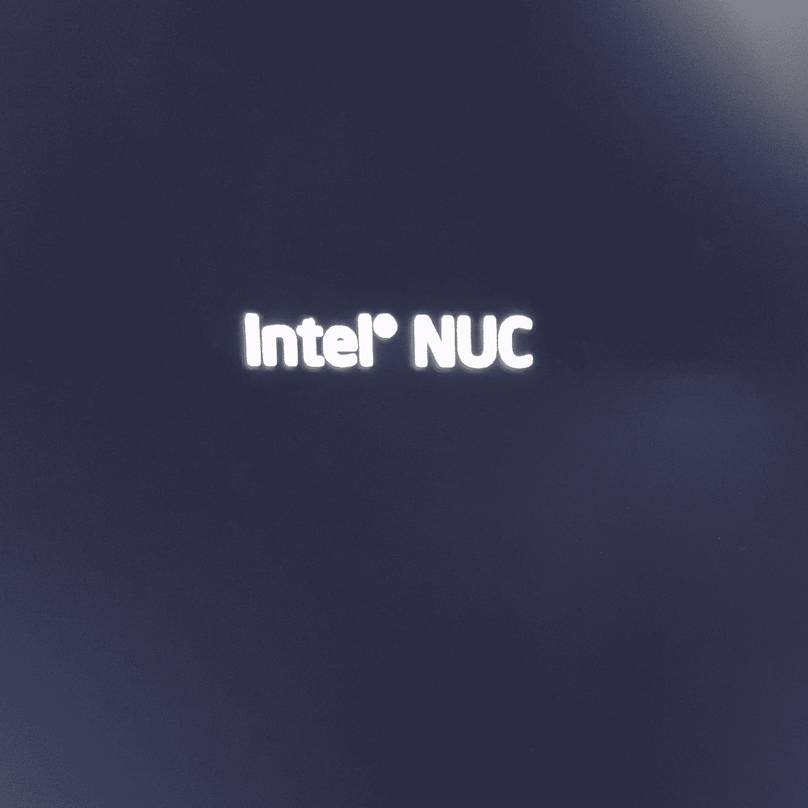
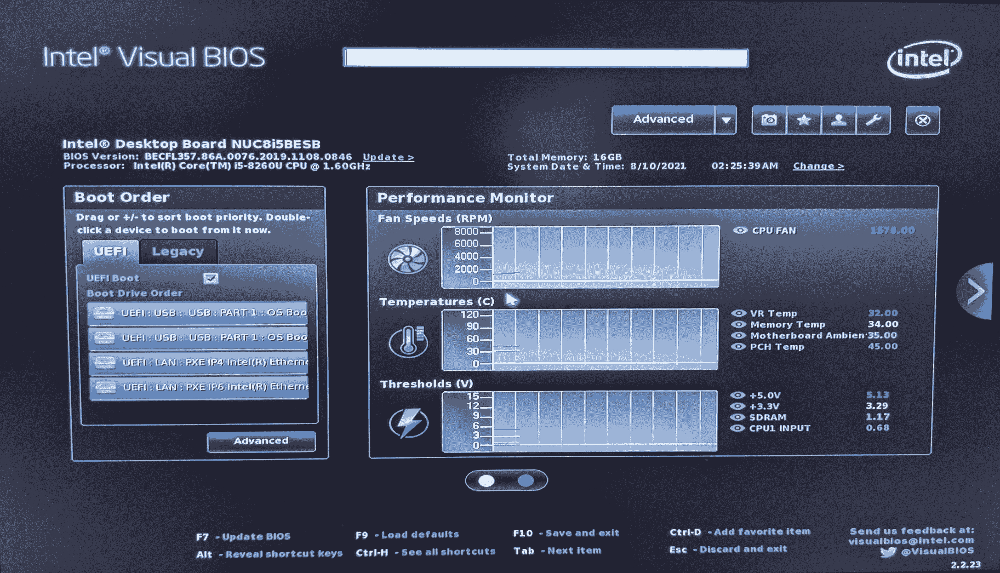
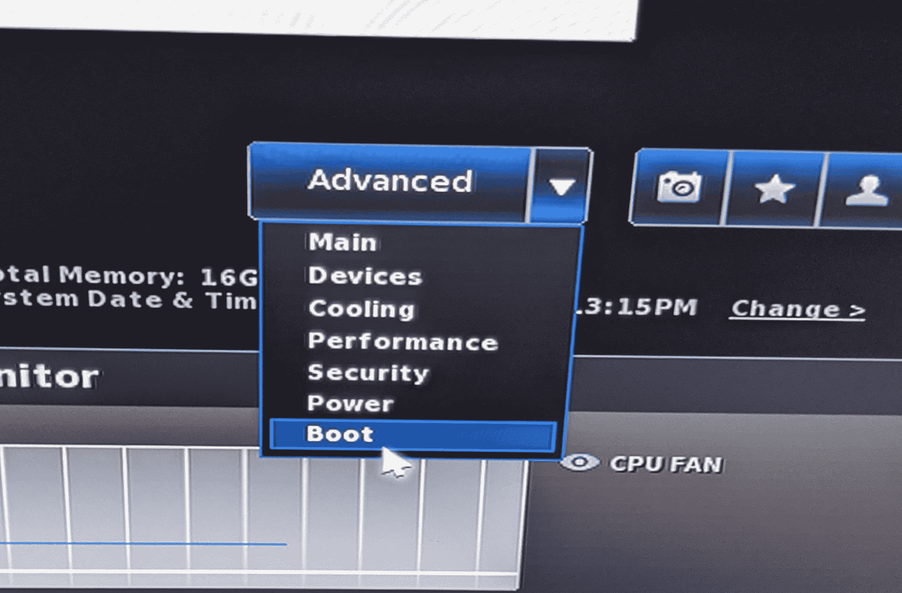
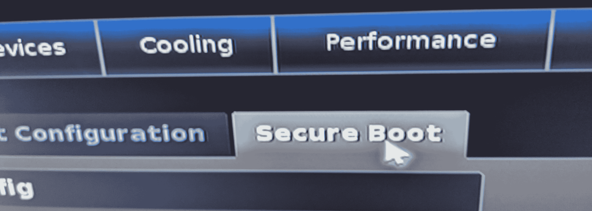
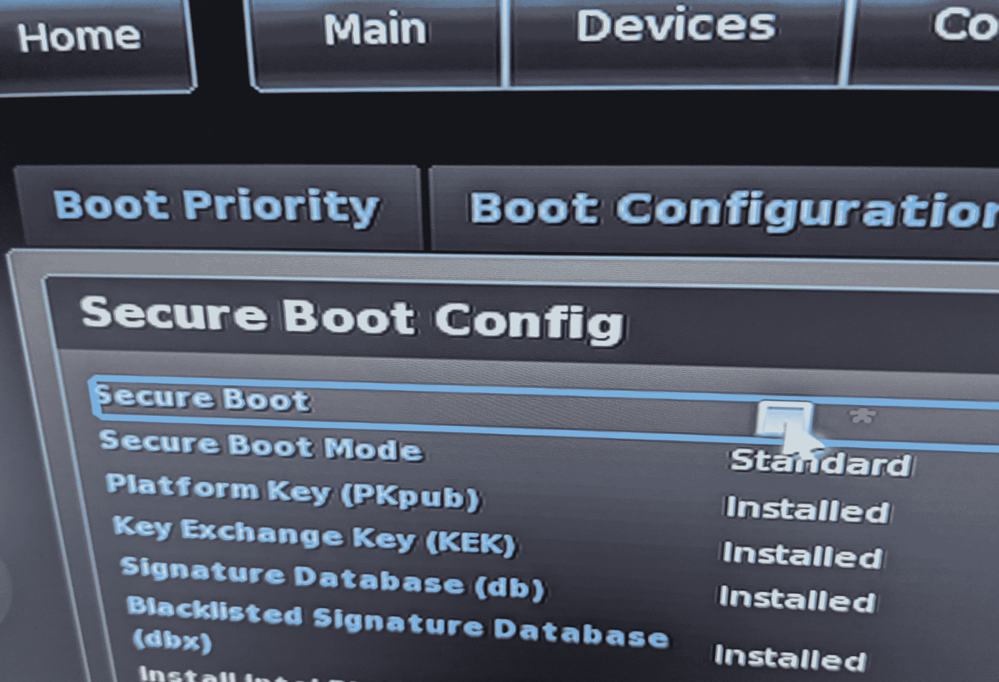
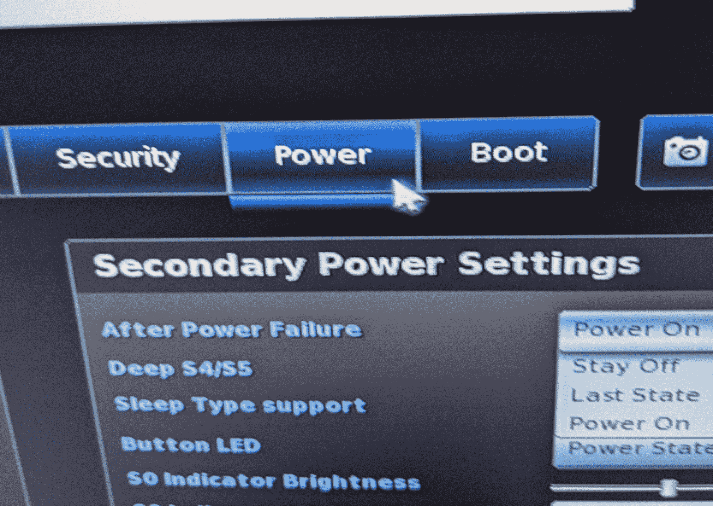
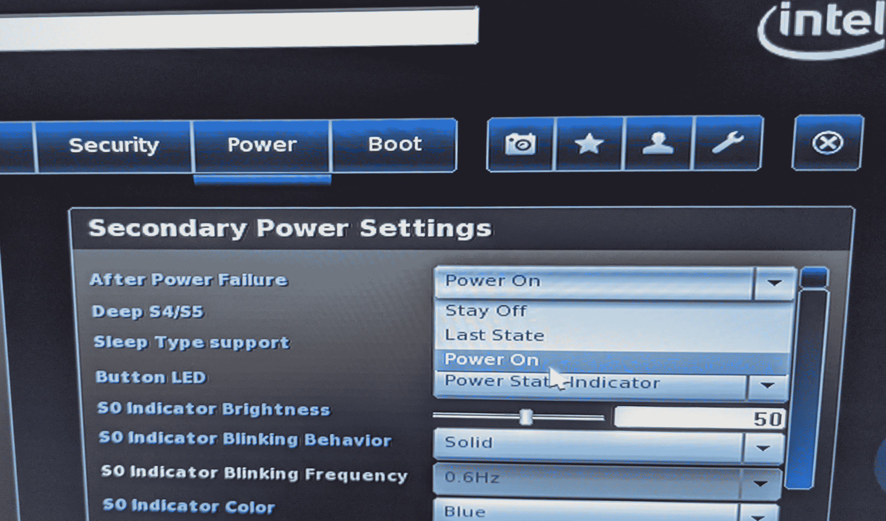
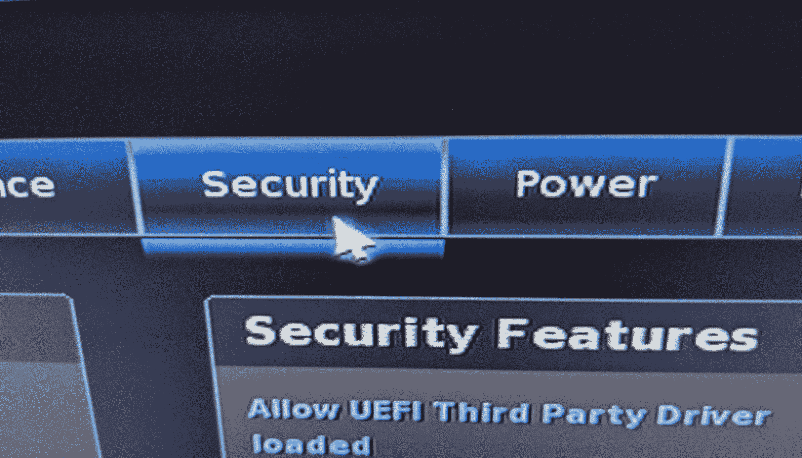
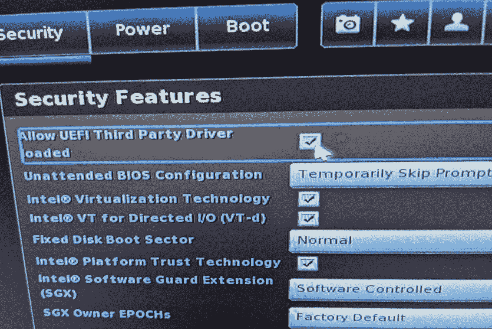

# Configuring the BIOS

This documentation describes how to configure the BIOS of an Intel NUC for compatibility with the stretch installation procedure.

## Accessing the NUC BIOS Settings

First plug in the NUC to a 19V DC power supply. Next power on the NUC using the power button on the front of the NUC.

When powered on, the NUC should display a welcome screen similar to the picture below:



When this label becomes visible press 'F2' to enter into the BIOS configuration menu.

!!! note

```
If you're using a Bluetooth keyboard, the BIOS likely won't recognize the F2 keypress.
```

The BIOS Settings page should look like the picture below:



Select the 'Advanced' drop down menu near the top right of the screen, and then slect the option 'Boot'



From the 'Boot' settings page select the 'Secure Boot' tab.



Turn off 'Secure Boot' by toggling the checkbox labeled 'Secure Boot' to unchecked.



Next Select the 'Power' tab



From the power settings screen select the 'Power On' option from the 'After Power Failure' drop down selection.



Next Select the Security tab



Turn on UEFI third party drivers compatibility by toggling the checkbox labeled 'Allow UEFI Third Party Driver loaded' to checked.



Now use the F10 key to save BIOS configuration changes and exit.

***

All materials are Copyright 2020-2026 by Hello Robot Inc. Hello Robot and Stretch are registered trademarks.
